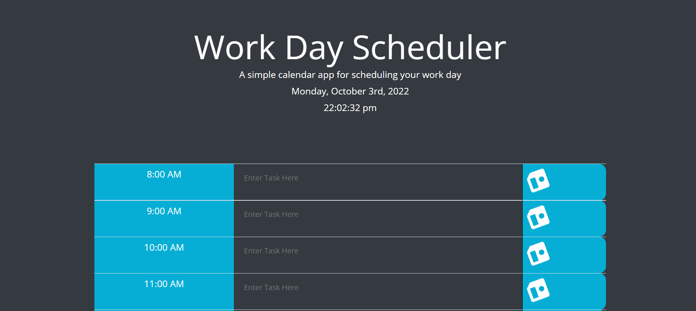

# Work Day Scheduler Starter Code

## <strong>Description</strong>

For Module 5, we are tasked to create a Interactive Calendar for a work day

## <strong>Acceptance Criteria</strong>

♦ Create a planner with current date on top of webpage

♦ When scrolling down, presented with time blocks for standard business hours

♦ Time blocks are color-coded to indicate whether past/present/future

♦ Entering an event and saving, saves data

♦ Refreshing page keeps saved data

## <strong>Criteria Met</strong>

♦ Dates and hours represented on page

♦ Saved data persists 

♦ Standard hours shown on page

### <strong>Website Link</strong>

https://github.com/FleischmanJ88/05-Work-Planner

### <strong>Screenshot</strong>

### <strong>Contact Information</strong>

https://github.com/FleischmanJ88